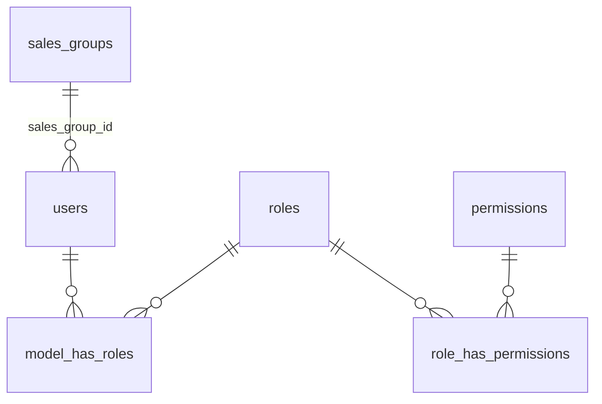

# Sales groups roles permissions

## Overview

Admin tạo tài khoản login và quản lý **nhóm bán hàng** (`sales_groups`) theo sàn (`ebay` | `tiktok` | `amazon`). Roles Spatie thay bằng `admin`, `seller`, `group_leader`. Seller/leader bắt buộc `sales_group_id`; admin không gắn nhóm. Gate API bằng **permission** (không hardcode `role:admin`), hiện chỉ admin được seed các quyền users/roles/sales-groups.

## Contract

| Field | Value |
|-------|--------|
| Outcome | CRUD sales groups; user create/update với role + group rule; permission middleware trên users/roles/sales-groups; seed matrix đầy đủ |
| Constraints | Laravel 11 + Sanctum + Spatie; Option 1 FK `users.sales_group_id`; giữ `orders.seller_id` riêng; SQLite-safe (không MySQL ENUM); chỉ admin có quyền quản trị user/role/group ở v1 |
| Non-goals | Spatie teams; multi-group pivot; Role CRUD API; FE; đổi Printify/eBay import behavior |
| Acceptance | Admin CRUD nhóm + tạo seller/leader kèm nhóm; seller 403 trên admin APIs; admin không cần nhóm; seller/leader thiếu nhóm → 422; seeder chỉ còn 3 roles mới |

## Goals

| # | Goal | Priority |
|---|------|----------|
| 1 | Schema `sales_groups` + `users.sales_group_id` | P1 |
| 2 | Seed roles/permissions English dotted + matrix | P1 |
| 3 | Wire User / Role / SalesGroup APIs + middleware | P1 |
| 4 | Feature tests + `API_DOCS.md` | P1 |

## Evidence (pre-plan)

- User CRUD + login đã có; `/roles` chỉ list; routes users/roles **chưa** `permission:`.
- Seed cũ: `admin` / `manager` / `sale` / `buyer` + permission VN lẫn English.
- Draft đã tạo (chưa hoàn thiện): migration `2026_08_05_000015_*`, `SalesGroup` model, `SalesGroupController` — phase 1–3 phải align với design này.
- Existing plans eBay import: **completed**, no cross-plan block.

## Architecture

**Permission catalog (seed):**  
`users.view|create|update|delete`, `roles.view`, `sales-groups.view|create|update|delete`, giữ `orders.import` + `printify.*`, chuẩn hoá orders CRUD English (`orders.view|create|update|delete|export`).

**Matrix:** admin = all; `group_leader` = orders (+ import/export) + printify, không users/roles/sales-groups; `seller` = `orders.view|create|update` only.

## Phases

| # | Phase | Status | Depends |
|---|-------|--------|---------|
| 1 | [Schema sales_groups](./phase-01-start.md) | Completed | — |
| 2 | [Seed roles and permissions](./phase-02-seed-roles-and-permissions.md) | Completed | 1 |
| 3 | [Wire APIs and middleware](./phase-03-wire-apis-and-middleware.md) | Completed | 1, 2 |
| 4 | [Tests and API docs](./phase-04-tests-and-api-docs.md) | Completed | 3 |

## Success Criteria

- [x] Migration applies on SQLite/MySQL; FK + platform index present
- [x] Seeder yields only `admin`, `seller`, `group_leader` with matrix above
- [x] `/api/sales-groups` CRUD works for admin; 403 without permission
- [x] User store/update enforces group rules by role
- [x] Feature tests green; `API_DOCS.md` documents roles, permissions, sales-groups, user payload

## Risks

| Risk | Mitigation |
|------|------------|
| Existing DB có user gắn role cũ | Seeder migrate `sale`→`seller`, `manager`→`group_leader`, `buyer`→`seller` rồi xoá role cũ |
| Permission VN còn trong DB | Seeder tạo English mới, re-sync roles, xoá orphan VN names |
| Double-hash password / unrelated bugs | Out of scope — không đụng trừ khi chạm cùng dòng |

## Open Questions

None — Option 1 FK, permission gate, replace roles, admin-only manage đã chốt.

<!-- slug: sales-groups-roles-permissions -->
