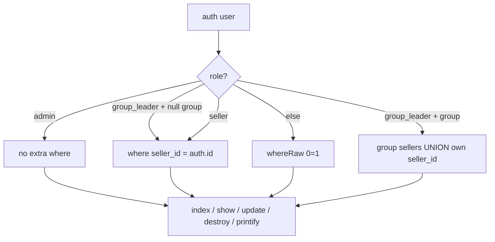

# Order visibility by role

## Overview

`GET /api/orders` (and related order mutations) currently return **all** eBay orders to any authenticated user. Completed plans only granted `orders.view` — they never defined row-level visibility. This plan adds server-side scoping so a logged-in **seller** / **group_leader** only sees allowed orders; **admin** stays unrestricted.

## Contract

| Field | Value |
|-------|--------|
| Outcome | Role-based order visibility on list/detail/update/destroy and Printify preview/create for an `{order}`; non-admin cannot reassign `seller_id` via update |
| Constraints | Laravel 11 + Sanctum + Spatie roles; reuse `orders.seller_id` + `users.sales_group_id`; mirror non-admin filter style from `PrintifyShopController` (`whereRaw('0 = 1')` when denied); prefer scoped `findOrFail` → 404 (no existence leak); deny-by-default for non-matching roles |
| Non-goals | FE filter UX; attaching Spatie `permission:orders.*` on CRUD routes; scoping CSV/JSON import or export write paths; changing Printify shop assignment; Spatie teams; auto-backfill of null `seller_id` on historical CSV rows |
| Acceptance | Seller index only own `seller_id`; leader index = group sellers' orders **OR** own `seller_id` if leader has null group; admin unchanged; cross-scope show/update/destroy/printify → 404; non-admin update cannot change `seller_id`; Feature tests green (including fixes to `OrderShowHttpTest`); `API_DOCS.md` documents rules + null-`seller_id` / residual risks |

## Confirmed visibility rules (HOLD SCOPE)

| Role | Visible orders |
|------|----------------|
| `admin` | All |
| `seller` (hasRole seller, not admin) | `orders.seller_id = auth.id` |
| `group_leader` with `sales_group_id` set | Orders whose `seller.sales_group_id = auth.sales_group_id` **UNION** `orders.seller_id = auth.id` |
| `group_leader` with `sales_group_id` null | Own rows only: `orders.seller_id = auth.id` (so multi-role leader+seller is not blinded) |
| No matching role (roleless / permission-only) | None (`0 = 1`) — **deny-by-default**, never fall through to seller scope |
| `seller_id` null on order | **Admin only** |

**Data reality (red-team):** CSV import (`persistCsvOrder`) does **not** set `seller_id`. Until ops assign sellers (or a future import change), most production CSV orders are admin-only under this rule. Document that explicitly — do not claim “import already sets seller_id.”

Request filters (`seller_id`, `search`, dates, …) remain **AND**-ed with visibility — a seller cannot widen scope by passing another `seller_id`.

**Update payload:** non-admin must not change `seller_id` (reject / ignore). `buyer_id` may stay as today or same restriction — prefer forbid `seller_id` mutation for non-admin.

## Architecture

**Implementation preference:** Eloquent `Order::scopeVisibleTo(User $user)`. Controllers call the scope; no new middleware.

**Printify ordering (mandatory):** In `preview` / `create`, run scoped order re-query / `findOrFail` **before** `validatedShopAndMappings()`, so out-of-scope orders always return **404**, never shop-assignment **422**.

## Evidence

- `OrderController::index` — no auth-based filter; optional `seller_id` query only (`app/Http/Controllers/Api/OrderController.php`)
- Routes: `apiResource('orders')` under `auth:sanctum` only — no row policy (`routes/api.php`)
- CSV import never sets `seller_id` (`OrderImportService::persistCsvOrder`)
- Pattern to copy: non-admin shop index filter (`PrintifyShopController` ~46–51)
- Existing tests will break without updates: `tests/Feature/OrderShowHttpTest.php` (roleless actor + null `seller_id`)
- Cross-plan: `260805-2319-printify-multi-account-management` pending but orthogonal — no `blockedBy`

## Goals

| # | Goal | Priority |
|---|------|----------|
| 1 | Add deny-by-default `scopeVisibleTo` + wire OrderController (+ update seller_id guard) | P1 |
| 2 | Close Printify `{order}` IDOR with visibility-first check | P1 |
| 3 | Feature tests (new + fix existing) + API docs + residual risks | P1 |

## Phases

| # | Phase | Status | Depends |
|---|-------|--------|---------|
| 1 | [Scope + controllers](./phase-01-start.md) | Pending | — |
| 2 | [Tests and API docs](./phase-02-tests-and-api-docs.md) | Pending | 1 |

## Success Criteria

- [ ] Seller cannot list/show/update/delete another user's order
- [ ] Leader sees group sellers' orders (and own `seller_id` rows); null-group leader still sees own rows
- [ ] Roleless user sees empty list / 404 on show
- [ ] Null-`seller_id` orders visible to admin only
- [ ] Admin behavior unchanged for assigned orders
- [ ] Printify preview/create on out-of-scope order → **404** (even if shop unassigned)
- [ ] Non-admin cannot reassign `seller_id` via update
- [ ] `OrderShowHttpTest` and `OrderVisibilityTest` green; `API_DOCS.md` documents visibility + null-seller / residual risks

## Risks

| Risk | Mitigation |
|------|------------|
| Leader expects “all platform orders” | Document rule; HOLD SCOPE rejects expansion |
| CSV orders have null `seller_id` → staff see empty lists | Document as known; admin-only until assign; **non-goal** to backfill in this plan |
| Import write can set foreign `seller_code` (group_leader has `orders.import`) | **Residual** — out of scope; track separately |
| Seller can `DELETE` own orders despite seed lacking `orders.delete` | **Residual** — routes lack `permission:orders.*` (non-goal); scope does not add delete permission middleware |
| Multi-role leader + null group | Union/fallthrough to own `seller_id` (locked above) |
| Leader `whereHas` performance | Soft claim — revisit after measure; do not assert wrong index |

## Open Questions

None for visibility matrix. Residual import write-IDOR and CRUD permission middleware deferred deliberately (non-goals).

## Red Team Review

### Session — 2026-08-06
**Findings:** 10 adjudicated (8 accepted into plan, 1 reject-implement→residual, 1 residual-only for destroy/RBAC)
**Severity breakdown:** 2 Critical, 5 High, 3 Medium (after dedupe)

| # | Finding | Severity | Disposition | Applied To |
|---|---------|----------|-------------|------------|
| 1 | CSV import leaves `seller_id` null — “import sets seller_id” false | Critical | Accept | plan Risks/Contract; Phase 2 docs |
| 2 | `OrderShowHttpTest` will fail under scope | Critical | Accept | Phase 2 related files + steps |
| 3 | Fail-open non-role → seller scope | High | Accept | Phase 1 sketch + rules table |
| 4 | Printify shop validate before visibility | High | Accept | Phase 1 Printify ordering |
| 5 | Update can reassign `seller_id` | High | Accept | Phase 1 update guard |
| 6 | Destroy vs missing `orders.delete` | High | Accept (residual risk only) | plan Risks |
| 7 | Import cross-group `seller_code` | High | Reject implement / residual | plan Risks + Non-goals |
| 8 | Leader+seller null group blinded | Medium | Accept | Phase 1 union/fallthrough |
| 9 | Test matrix missing roleless + null-seller | Medium | Accept | Phase 2 matrix |
| 10 | Wrong index performance claim | Medium | Accept | Phase 1 risks softened |

### Whole-Plan Consistency Sweep

- Decision delta applied: deny-by-default; leader null-group → own rows; Printify visibility-first; non-admin no `seller_id` update; CSV null-seller documented; existing HTTP tests must be updated.
- Removed/superseded: “import should keep setting `seller_id`”; “else treat as seller-scoped”; “index already on orders.seller_id makes whereHas fine”; Phase 2 “assert before shop validation” as test-only ordering hint.
- Duplicate contracts in `plan.md` + both phases reconciled to the same matrix.
- Unresolved contradictions: **none**.

<!-- slug: order-visibility-by-role -->
