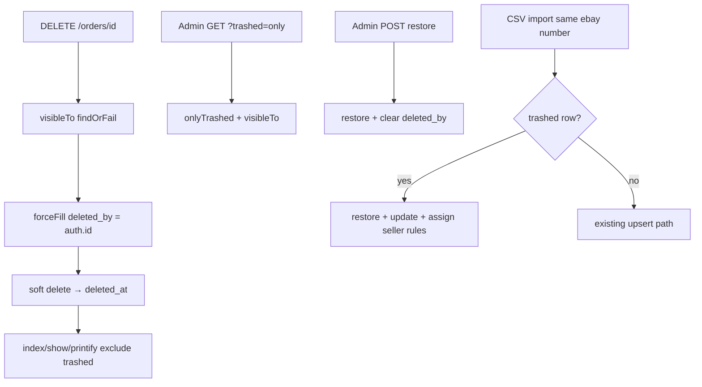

# Order soft delete and deleted-by audit

## Overview

Production incident (2026-08-06 ~22:16): Admin UI hard-deleted orders (`DELETE /api/orders/{id}` → 200), then re-imported under another seller. Rows and IDs were gone; batch_item FKs nulled (`nullOnDelete`). This plan switches **order** delete to Laravel SoftDeletes, records **who** deleted, and adds admin restore + CSV revive so the same ebay number does not create a new orphan row.

## Scope (HOLD)

| In | Out |
|----|-----|
| `orders` SoftDeletes (`deleted_at`) | Soft-delete `users` / `sales_groups` / Printify models |
| `deleted_by` FK → `users` | Separate audit_log table / event stream |
| `DELETE /orders/{id}` sets `deleted_by` then soft-deletes | `forceDelete` API / purge job |
| Admin restore + admin trash list (`?trashed=only`) | FE trash UI polish (docs only for API) |
| CSV upsert **revives** soft-deleted row by `ebay_order_number` | Changing who may call delete (permission middleware already partial gap — out of scope unless needed for tests) |

**Assumption:** Feature applies only to eBay `orders` (the path that lost data). Confirm if later expansion needed.

## Contract

| Field | Value |
|-------|--------|
| Outcome | Soft-deleted orders disappear from normal list/show/printify; `deleted_by` + `deleted_at` set; admin can list trash + restore; CSV re-import restores same row |
| Constraints | Laravel SoftDeletes; keep `scopeVisibleTo`; unique `ebay_order_number` / `ebay_order_id` still hold for trashed rows |
| Non-goals | Hard-delete purge UI; soft-delete line items table; Spatie activity log package |
| Acceptance | Feature tests: soft delete, deleted_by, 404 when trashed for non-admin paths, admin restore, CSV revive; `API_DOCS.md` §4.4 updated |

## Architecture



**Delete path (phase 1):**

```php
$order = Order::query()->visibleTo($request->user())->findOrFail($id);
$order->forceFill(['deleted_by' => $request->user()->id])->save();
$order->delete(); // SoftDeletes
```

**Import revive (phase 2):** Before/inside `persistCsvOrder`, query `withTrashed()` by `ebay_order_number`. If trashed → `restore()`, clear `deleted_by`, then continue upsert fill (seller attribution rules unchanged: set only on create or null seller_id).

## Evidence

- Hard delete today: `OrderController::destroy` → `->delete()` with no SoftDeletes (`app/Http/Controllers/Api/OrderController.php`)
- No SoftDeletes usage anywhere in repo (grep empty)
- `order_import_batch_items.order_id` → `nullOnDelete` — soft delete keeps FK; hard delete nulls it (seen on prod batch 15/16)
- Visibility plan completed: `plans/260806-2124-order-visibility-by-role/` — soft delete must stay compatible with `scopeVisibleTo`
- Nginx: mass `DELETE /api/orders/71…103` from admin UI before Thanhmai re-import

## Goals

| # | Goal | Priority |
|---|------|----------|
| 1 | Migration SoftDeletes + `deleted_by`; wire destroy | P1 |
| 2 | Admin trash list + restore; CSV revive trashed | P1 |
| 3 | Feature tests + API_DOCS | P1 |

## Phases

| # | Phase | Status | Effort |
|---|-------|--------|--------|
| 1 | [Schema + soft destroy + deleted_by](./phase-01-start.md) | Pending | 2-3h |
| 2 | [Admin restore + import revive](./phase-02-admin-restore-and-import-revive.md) | Pending | 2-3h |
| 3 | [Tests and API docs](./phase-03-tests-and-api-docs.md) | Pending | 2h |

## Success Criteria

- [ ] Soft-deleted order absent from default `GET /orders` and returns 404 on show/printify
- [ ] `deleted_by` = actor id; `deleted_at` set
- [ ] Admin can `?trashed=only` and `POST /orders/{id}/restore`
- [ ] CSV re-import of trashed ebay number restores same `id` (no new auto-increment gap for that number)
- [ ] Feature tests green; `API_DOCS.md` documents soft delete + restore + revive

## Risks

| Risk | Mitigation |
|------|------------|
| Unique key blocks insert while row is soft-deleted | Revive path uses `withTrashed()` — never insert duplicate |
| Route model binding `{order}` may 404 on trashed before controller | Use id + explicit query, or `withTrashed` only on restore route |
| Sellers with accidental delete rights wipe own rows | Soft delete recoverable; still document who may delete (existing seed: admin/leader have `orders.delete`; route may lack middleware — note residual) |

## Residual (document, do not fix here)

- ~~`apiResource('orders')` destroy lacks `permission:orders.delete`~~ → owned by `plans/260806-2237-order-delete-permission-and-dual-layer-menu-auth/` (seller must not delete; gate destroy + fix seller-as-deleter soft-delete tests).

<!-- slug: order-soft-delete-and-deleted-by-audit -->
