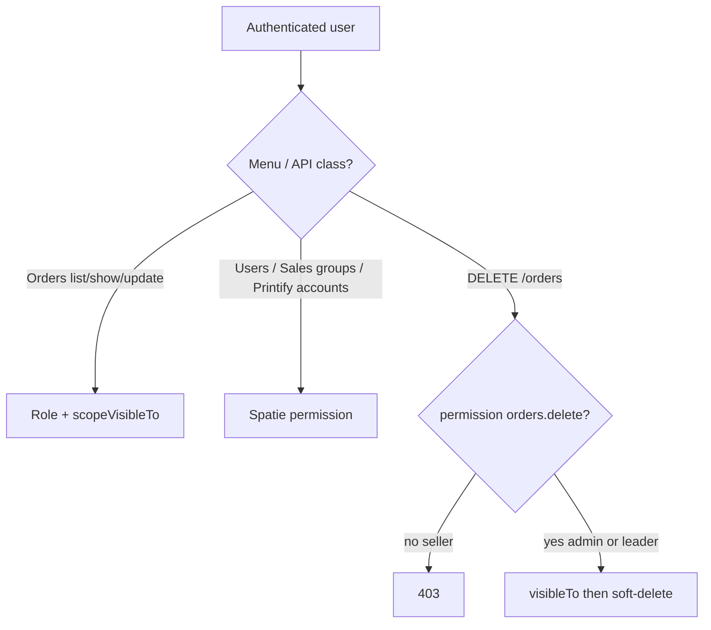

# Order delete permission and dual-layer menu auth

## Overview

Brainstorm settled a **dual-layer** model: sellers reach Orders by role and only see scoped rows (`scopeVisibleTo`); admin menus (Users, Sales groups, Printify accounts, …) show/hide via Spatie permissions from `/me`. Gap: seed denies sellers `orders.delete`, but `DELETE /orders/{id}` is auth-only, so sellers still soft-delete own orders. This plan gates destroy with `permission:orders.delete` and documents the dual-layer contract for FE.

## Contract

| Field | Value |
|-------|--------|
| Outcome | Seller `DELETE` → **403**; admin / group_leader (seeded `orders.delete`) still soft-delete within visibility; API_DOCS states dual-layer menu + delete rules for FE |
| Constraints | Spatie middleware alias `permission:`; keep `scopeVisibleTo` after permission check; reuse existing seed matrix (do not grant seller `orders.delete`); soft-delete + `deleted_by` behavior unchanged |
| Non-goals | FE AppSidebar implementation (separate repo); attaching `permission:orders.view|update` on list/show/update; changing import/export gates; Spatie teams; stripping `orders.delete` from `group_leader` |
| Acceptance | Seller destroy → 403, row intact; leader/admin destroy own-scope → 200 + soft-delete; `OrderSoftDeleteTest` no longer uses seller as deleter; API_DOCS dual-layer + §4.4 permission; Feature tests green |

## Scope (HOLD)

| In | Out |
|----|-----|
| `permission:orders.delete` on destroy route | Middleware on index/show/update |
| Fix soft-delete tests that assert seller can delete | FE sidebar/router code |
| Document dual-layer + menu permission map in `API_DOCS.md` | New permissions or roles |
| Seller cannot delete (product rule) | Removing leader delete rights |

## Architecture



**Route change (preferred):** register destroy explicitly with middleware; exclude from `apiResource` (same pattern as `restore`):

```php
Route::delete('/orders/{id}', [OrderController::class, 'destroy'])
    ->middleware('permission:orders.delete');
Route::apiResource('orders', OrderController::class)->except(['store', 'destroy']);
```

Permission runs before controller; controller keeps `visibleTo` → 404 out-of-scope.

**Seed (unchanged):**

| Role | `orders.delete` |
|------|:---------------:|
| admin | ✓ |
| group_leader | ✓ |
| seller | — |

**FE contract (docs only):** Orders menu → role `seller`\|`group_leader`\|`admin`; hide delete UI without `orders.delete`; Users → `users.view`; Sales groups → `sales-groups.view`; Printify accounts → `printify.accounts.view`; etc. Source: nested `roles[].permissions[]` on login/`/me`.

## Evidence

- Seeder: seller lacks `orders.delete`; leader/admin have it — `database/seeders/RolePermissionSeeder.php`
- Destroy auth-only: `routes/api.php` `apiResource('orders')`
- Soft-delete already wired in `OrderController::destroy`; seller currently succeeds in `OrderSoftDeleteTest::test_destroy_soft_deletes_and_sets_deleted_by`
- Docs residual calls out seller delete gap — `API_DOCS.md` §4 Visibility
- Soft-delete plan deferred this gap — `plans/260806-2228-...` Residual → owned here
- Prior visibility plan explicitly non-goal’d CRUD permission middleware — this plan only closes **delete**

## Cross-plan

| Plan | Relation |
|------|----------|
| `260806-2228-order-soft-delete-and-deleted-by-audit` | Same destroy path; soft-delete behavior stays; this plan adds permission gate + fixes seller-as-deleter tests. Soft-delete residual updated to point here. |
| `260806-2124-order-visibility-by-role` | Completed; keep row scope; do not attach view/update permissions |
| `260805-2107-sales-groups-roles-permissions` | Completed; admin menus already permission-gated |

## Goals

| # | Goal | Priority |
|---|------|----------|
| 1 | Gate `DELETE /orders/{id}` with `permission:orders.delete` | P1 |
| 2 | Tests (seller 403; leader/admin OK) + dual-layer API docs | P1 |

## Phases

| # | Phase | Status | Effort |
|---|-------|--------|--------|
| 1 | [Gate destroy with orders.delete](./phase-01-start.md) | Completed | 1h |
| 2 | [Tests and dual-layer API docs](./phase-02-tests-and-dual-layer-api-docs.md) | Completed | 1-2h |

## Success Criteria

- [x] Seller `DELETE /api/orders/{id}` → 403; order not soft-deleted
- [x] Admin and group_leader with visibility still soft-delete successfully
- [x] `OrderSoftDeleteTest` / any destroy Feature tests use permitted actors
- [x] `API_DOCS.md` documents dual-layer auth + `orders.delete` on §4.4; removes stale “seller can DELETE” residual
- [x] No seeder change required (matrix already correct)

## Risks

| Risk | Mitigation |
|------|------------|
| Soft-delete tests break (seller deleter) | Phase 2: switch actor to admin/leader; add dedicated seller-403 test |
| FE still shows delete button for seller | Docs map + FE follow-up; API remains authoritative |
| Leader delete undesired later | Out of scope; change seeder in a separate decision |

## Residual (document, do not fix here)

- Order list/show/update still auth-only (no `orders.view`/`orders.update` middleware) — intentional dual-layer
- Import template still auth-only vs import POST needing `orders.import`
- FE sidebar/route guards → `eagle-life-admin-fe/plans/260806-2247-fe-dual-layer-menu-and-order-delete-visibility/`

<!-- slug: order-delete-permission-and-dual-layer-menu-auth -->
